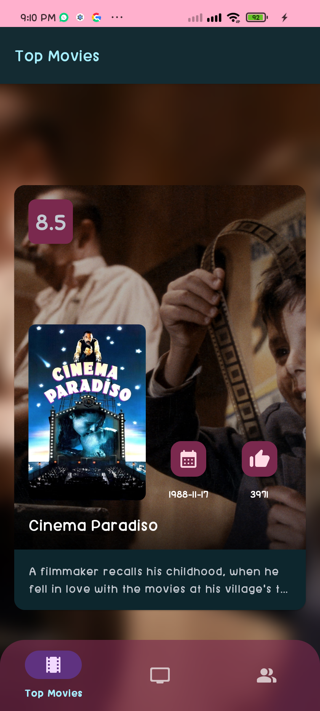
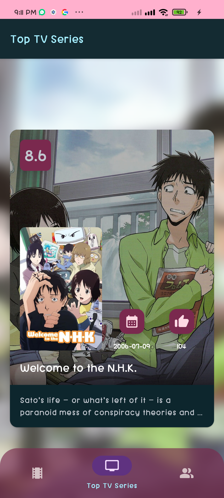
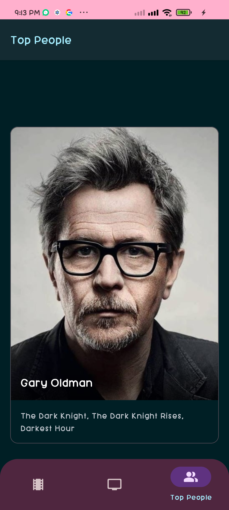

# Movies App 

Movies App es una aplicación móvil que brinda una experiencia cinematográfica increíble. Te permite descubrir una amplia variedad de películas populares, ver información detallada sobre cada película y explorar su mundo de cine favorito. Con Movies App, puedes mantenerte actualizado sobre las últimas películas, conocer las calificaciones, ver sinopsis y explorar imágenes de películas.

## Funcionalidades y Características ✨

- Explora una amplia colección de películas populares. 
- Mira imágenes de las películas y sus carteles. 
- Interfaz de usuario intuitiva y fácil de usar. 
- Actualización constante de las películas populares.

## Tecnologías Utilizadas 🛠️

  
- Kotlin para el desarrollo de la aplicación. 
- Retrofit y OkHttp para realizar solicitudes a la API de TheMovieDB. 
- Coil para la carga eficiente de imágenes. 
- AndroidX para componentes de interfaz de usuario y soporte de arquitectura. 


## Aprendizaje y Destrezas Adquiridas 🦾

Al desarrollar Movies App, adquirí las siguientes habilidades y conocimientos: 
- Uso de Retrofit y OkHttp para realizar solicitudes HTTP a una API. 
- Utilización de bibliotecas de AndroidX para construir una interfaz de usuario amigable. 
- Manejo de recursos multimedia, como imágenes y descripciones de películas. 
- Configuración de un entorno de desarrollo de Android. 
- Resolución de problemas y depuración en una aplicación de Android.

## Información de la API 🌐

Para ejecutar la aplicación, necesitarás una clave de API válida de TheMovieDB. Debes registrar tu aplicación en [TheMovieDB](https://www.themoviedb.org/documentation/api) para obtener una clave de API. Una vez que tengas la clave de API, debes reemplazar la variable `API_KEY` en el proyecto por tu clave de API en el archivo   `Constants.kt`. Además, verifica y asegúrate de que los puntos finales de la API en el archivo `MovieService.kt` sean correctos y estén actualizados con la documentación de TheMovieDB.

**API Utilizada**

| Nombre         | Descripción                                                   | API Url                       |
|----------------|---------------------------------------------------------------|-------------------------------|
| TheMovieDB API | Una API que proporciona información sobre peliculas y series. | https://api.themoviedb.org/3/ |

**Endpoints utilizados**

| Método | Endpoint        | Descripción                                                      |
|--------|-----------------|------------------------------------------------------------------|
| GET    | movie/top_rated | Obtiene una lista de peliculas mejor valoradas.                  |
| GET    | tv/top_rated    | Obtiene una lista de series de tv mejor valoradas.               |
| GET    | person/popular  | Obtiene una lista de personas populares en el cine y televisión. |

## Capturas de Pantalla 🖼️

<div align="center">
	   
</div>

## Requisitos del Sistema 📔

Para ejecutar la aplicación en un dispositivo Android, debes cumplir con los siguientes requisitos del sistema:

-   Dispositivo Android con sistema operativo Android 5.0 (Lollipop) o superior.
-   Conexión a Internet para cargar datos de pelicuas desde la API.
-   Se recomienda un dispositivo con al menos 2 GB de RAM para un rendimiento óptimo.

### **Dependencias Gradle**

A continuación, se muestra una lista de las dependencias Gradle utilizadas en el proyecto Movies App. Puedes agregar estas dependencias en tu archivo `build.gradle` para configurar el entorno de desarrollo y las bibliotecas necesarias:

```gradle
dependencies {
	val retrofitVersion = "2.9.0"  
	val okhttpVersion = "4.11.0"  
	val coilVersion = "2.4.0"
	
	// Retrofit y GSON para solicitudes HTTP  
	implementation("com.squareup.retrofit2:retrofit:$retrofitVersion"){  
	  exclude(module = "okhttp")  
	}  
	implementation("com.squareup.retrofit2:converter-gson:$retrofitVersion")  
  
	// okhttp logging interceptor  
	implementation("com.squareup.okhttp3:okhttp:$okhttpVersion")  
	implementation("com.squareup.okhttp3:logging-interceptor:$okhttpVersion")  
  
	// coil Carga de imagenes  
	implementation("io.coil-kt:coil:$coilVersion")
  }
``` 

Asegúrate de mantener actualizadas las versiones de estas dependencias según las últimas versiones disponibles en el momento de desarrollo.

## Instalación y Uso 📥

1. Clona o descarga el repositorio en tu máquina local:

   ```shell
   git clone https://github.com/DaveDeveloper117/MoviesApp.git
   ``` 

2.  Abre el proyecto en Android Studio.

3. Obtén una clave de API válida de TheMovieDB y reemplaza la variable `API_KEY` en el archivo `Constants.kt`.

4. Verifica y actualiza los puntos finales de la API si es necesario en el archivo MovieService.kt. 
    
5.  Ejecuta la aplicación en un emulador de Android o dispositivo físico.

## Contribución 🤝

Las contribuciones son bienvenidas. Si deseas mejorar el proyecto o agregar funcionalidades adicionales, puedes hacer un fork del repositorio, realizar tus cambios y enviar una pull request.

## Licencia 🗝️

Este proyecto está licenciado bajo [MIT License](https://github.com/DaveDeveloper117/MoviesApp/blob/master/LICENSE).

## Contacto 📩

Si tienes alguna pregunta o sugerencia, no dudes en ponerte en contacto conmigo a través de mi dirección de correo electrónico: [dabicho803@gmail.com](mailto:dabicho803@gmail.com).
